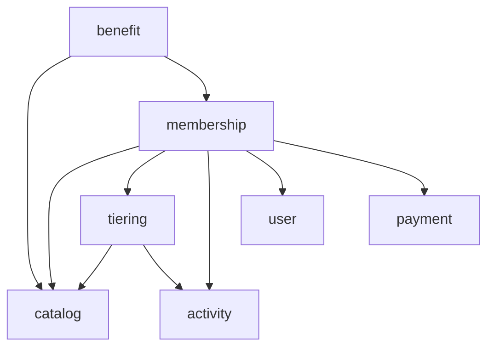

# FirstClub Membership Program

A backend for a subscription membership program with tiers. Members subscribe to a plan
(Monthly/Quarterly/Yearly) and hold a tier (Silver/Gold/Platinum) on top of it. Tiers carry
configurable benefits and are kept either by paying a fee or by meeting activity criteria — the
same way an Indian credit card waives its annual fee when you hit a spend target.

Stack: Java 21, Spring Boot 3.3, Spring Data JPA, in-memory H2. No external services to set up.

## Running it

You only need a JDK 21. The Maven Wrapper fetches Maven itself.

```bash
# macOS / Linux
./mvnw spring-boot:run

# Windows (PowerShell)
.\mvnw.cmd spring-boot:run
```

The app listens on `http://localhost:8080`. On first boot the catalog seeds itself
(3 plans, 3 tiers, 3 users) — look for `Seeded 3 plans, 3 tiers, 3 users.` in the log to
confirm. The database is in-memory, so a restart wipes any subscriptions and order activity
you create (the catalog re-seeds).

- **Demo** — copy-pasteable curl walkthrough in the [Demo](#demo) section below.
- **Swagger UI** — `http://localhost:8080/swagger-ui.html` to explore every endpoint.
- **H2 console** — `http://localhost:8080/h2-console` (JDBC URL `jdbc:h2:mem:membership`,
  user `sa`, empty password) to look at the tables directly.

```bash
./mvnw test            # unit + integration + a concurrency test
./mvnw clean package   # build target/membership-0.0.1-SNAPSHOT.jar
```

## How the model works

**Plan and tier are separate things.** A plan is what you pay for the subscription. A tier is a
status level you hold *on top of* the subscription, and it carries the benefits (free delivery,
extra discount, exclusive deals, priority support). The base tier is free with any subscription;
higher tiers cost money or have to be earned.

**You get a higher tier two ways:** pay its joining fee to jump in immediately, or qualify for it
through criteria (orders this month, spend this month, referrals, or belonging to a cohort).

**Keeping a higher tier is settled each month.** The system looks at last month's activity and
works out the highest tier you earned *for free*. Then:

- If that's at or above the tier you hold, there's no charge — and if you earned an even higher
  tier, you're promoted for free.
- If it's below the tier you hold, you owe only the **difference** between the two tiers' monthly
  fees, and you get a grace window to pay it. Pay in time and you keep your tier; let the window
  lapse and you settle down to the tier you actually earned.

Worked example with the seeded fees (Silver ₹0, Gold ₹199, Platinum ₹499 per month):

> You hold **Platinum**. Last month you only did enough to earn **Gold** for free. You owe
> `499 − 199 = ₹300` to keep Platinum for the month. Pay within the grace window → stay Platinum.
> Miss it → drop to Gold (which you keep for free). Had you earned Platinum for free, you'd owe
> nothing.

## Demo

A walk-through of the headline flows with curl. `requests.http` mirrors the same steps if you
prefer IntelliJ's HTTP Client or the VS Code REST Client extension. On Windows PowerShell,
`curl` is an alias for `Invoke-WebRequest` — use `curl.exe`, Git Bash, or WSL for the examples
below to work as written.

### Browse the catalog

```bash
curl http://localhost:8080/api/plans
curl http://localhost:8080/api/tiers
```

### Subscribe — happy path

Subscribe the seeded Demo User (id `1`) to the Yearly plan (id `3`) at the Gold tier (id `2`).
Charges the plan fee and Gold's joining fee.

```bash
curl -X POST http://localhost:8080/api/users/1/subscription \
  -H 'Content-Type: application/json' \
  -d '{"planId": 3, "tierId": 2}'
```

### Accrue activity

Five fulfilled orders crosses Gold's *5 orders or ₹5,000 spend* threshold.

```bash
for i in 1 2 3 4 5; do
  curl -X POST http://localhost:8080/api/orders/events \
    -H 'Content-Type: application/json' \
    -d '{"userId": 1, "amount": 1000}'
done
```

### See progress and settle the month

`progressToNextTier` updates live from those orders. Settling this month finds the criteria met,
so the fee is **waived** and Gold is retained.

```bash
curl http://localhost:8080/api/users/1/membership
curl -X POST http://localhost:8080/api/admin/tiering/run
```

### Apply benefits to a cart

A ₹2,000 cart with ₹50 delivery → 5% off + delivery waived → payable `1900.00`.

```bash
curl -X POST http://localhost:8080/api/users/1/benefits/preview \
  -H 'Content-Type: application/json' \
  -d '{"cartTotal": 2000, "deliveryFee": 50}'
```

### Difference-fee path

Upgrade to Platinum (pays its joining fee), then settle a fresh month with no activity — the
difference is invoiced. Pay it within the grace window to retain Platinum.

```bash
curl -X POST http://localhost:8080/api/subscriptions/1/upgrade \
  -H 'Content-Type: application/json' \
  -d '{"targetTierId": 3}'

curl -X POST 'http://localhost:8080/api/admin/tiering/run?period=2026-07'

# The FEE_INVOICED row carries the paymentId.
curl http://localhost:8080/api/subscriptions/1/settlements

# Substitute the paymentId from above.
curl -X POST http://localhost:8080/api/payments/<paymentId>/confirm
```

### Downgrade on lapsed grace

Drop the grace window to 0 days (runtime config — no restart), settle another fresh month,
and sweep: the unpaid Platinum drops to the free-eligible tier.

```bash
curl -X PUT http://localhost:8080/api/admin/policy \
  -H 'Content-Type: application/json' \
  -d '{"graceWindowDays": 0}'

curl -X POST 'http://localhost:8080/api/admin/tiering/run?period=2026-08'
curl -X POST http://localhost:8080/api/admin/tiering/grace-sweep
curl http://localhost:8080/api/users/1/membership
```

### Reconfigure a tier live

Retune Gold's thresholds and benefits without a redeploy.

```bash
curl -X PUT http://localhost:8080/api/admin/tiers/2 \
  -H 'Content-Type: application/json' \
  -d '{
    "name": "Gold", "rank": 1,
    "joiningFee": 499, "monthlyFee": 199,
    "active": true,
    "criteriaCombinator": "ANY",
    "benefits": [
      {"type": "FREE_DELIVERY"},
      {"type": "EXTRA_DISCOUNT_PERCENT", "value": 7}
    ],
    "criteria": [
      {"type": "ORDER_COUNT", "operator": "GTE", "threshold": 3},
      {"type": "COHORT", "stringValue": "VIP"}
    ]
  }'
```

## Endpoints at a glance

| Area | Endpoints |
|---|---|
| Catalog (public) | `GET /api/plans`, `GET /api/tiers` |
| Catalog (admin CRUD) | `/api/admin/plans`, `/api/admin/tiers`, `/api/admin/policy` |
| Users | `POST /api/users`, `GET /api/users/{id}`, `PATCH /api/users/{id}/cohort` |
| Membership (commands) | `POST /api/users/{id}/subscription`, `POST /api/subscriptions/{id}/{upgrade,downgrade,cancel}` |
| Membership (view) | `GET /api/users/{id}/membership`, `GET /api/subscriptions/{id}/settlements` |
| Orders | `POST /api/orders/events` |
| Benefits | `GET /api/users/{id}/benefits`, `POST /api/users/{id}/benefits/preview` |
| Settlement ops | `POST /api/admin/tiering/run`, `POST /api/admin/tiering/grace-sweep`, `POST /api/payments/{id}/confirm` |
| Lifecycle ops (admin) | `POST /api/admin/subscriptions/expire-due` |

## How the code is organised



Arrows point from a slice to what it depends on. Read it as: `catalog` and `user` are the
foundations, `tiering` is a pure engine sitting on top of them, and `membership` is the
orchestrator that ties everything together.

Packages are split by domain, not by layer, under `com.firstclub.membership`:

- `catalog` — the configurable business data: plans, tiers, benefits, criteria, policy.
- `user` — minimal user with a cohort.
- `activity` — turns order events into a per-month activity tally the tier engine reads.
- `tiering` — the criteria engine and the settlement rule. Deliberately has no dependency on the
  membership slice; it's handed the data it needs and returns decisions.
- `membership` — the subscription itself, the subscribe/upgrade/downgrade/cancel commands, and
  the code that orchestrates monthly settlement.
- `payment` — a payment gateway port with a mock implementation.
- `benefit` — resolves a user's active benefits and applies them to a sample cart.
- `common` / `config` — shared building blocks (money type, base entity, error handling) and
  app configuration/seeding.

Dependencies only point one way (`catalog ← tiering, membership`; `activity ← tiering`;
`payment ← membership`), so there are no cycles between slices.

## Design choices made

A few decisions shape the codebase; the rest is easiest to see by reading the slices.

- **Criteria are data, not code.** Each criterion (order count, spend, referrals, cohort) is a
  small strategy, and a tier combines its criteria with AND/OR. Thresholds live in the database
  and are editable through the admin API, so they can be retuned without a deploy.
- **The pricing rule sits behind an interface,** so changing *how* the fee is worked out never
  touches the code that decides *when* to charge.
- **Configuration is placed on purpose:** business data the team tunes lives in the DB with admin
  endpoints, infrastructure knobs live in `application.yml`, and state changes are named commands
  (subscribe, upgrade, cancel) rather than generic CRUD on a subscription row.
- **Concurrency is handled per case rather than with a blanket lock** — for example, order
  tallies use an atomic SQL increment so simultaneous orders can't lose updates. The other hot
  paths each get their own treatment.

## Tests

- Unit tests for the settlement math and the criteria/eligibility engine.
- A concurrency test that fires 50 simultaneous orders at one tally and checks nothing is lost.
- An integration test that drives the real HTTP stack through subscribe → orders → settle.

## Assumptions and scope

Kept deliberately narrow to focus on the domain design:

- In-memory H2 with Hibernate generating the schema. In production this would be a real database
  with Flyway/Liquibase migrations (noted in the code where it matters).
- No authentication; users are simple records. Payments go through a mock gateway.
- Single currency (INR). Joining a tier mid-cycle charges the full joining fee — no proration.
- Two separate clocks: a subscription's lifetime is tracked to the day (start date + plan length)
  and a daily job expires lapsed memberships, while the tier-fee waiver is settled on calendar
  months. Per-user anniversary fee cycles and auto-renewal are out of scope.
